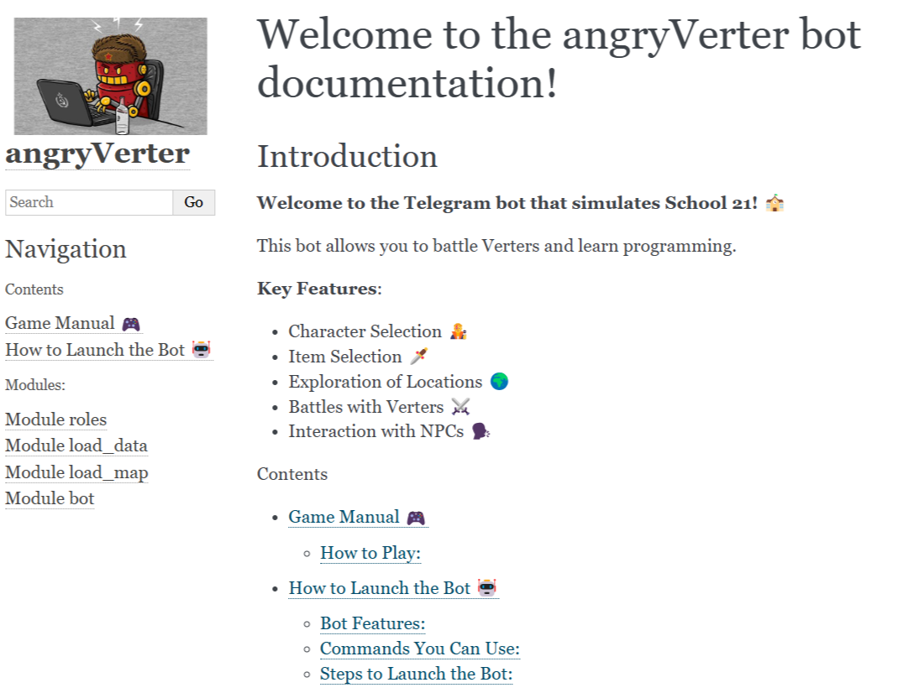

# AngryVerterBot: пошаговая игра в telegram для симуляции учёбы в Школе 21.

AngryVerterBot — это игровой Telegram-бот, созданный для моделирования учебного процесса в школе 21. Написан на Python с использованием фреймворков  `aiogram` и `asyncio`, задокументирвоанный `sphinx`, этот бот предлагает пошаговую игру, в которой пользователи могут пройти через весь учебный процесс, включая прохождение курсов, выполнение проектов и взаимодействие с другими персонажами.

## Архитектура и Технологии

### Объектно-ориентированное программирование (ООП)
Проект строится на принципах объектно-ориентированного программирования, что позволяет легко расширять функциональность и поддерживать чистый и понятный код. Основные классы включают в себя:

- **Player**: Игрок, который проходит через различные уровни и задачи.
- **NPC (Non-Player Character)**: Персонажи, с которыми игрок может взаимодействовать.
- **Verter**: Противники или препятствия, которые игрок должен преодолеть.

### Использование JSON Словарей
Вместо базы данных, мы используем простые начальные состояния игровых элементов в виде JSON словарей, которые кешируются в памяти. Это обеспечивает быстрый доступ и облегчает управление состоянием игры.

## Особенности

### Интерактивная Карта Школы
Игрок может перемещаться между различными комнатами и аудиториями, каждая из которых имеет уникальное описание и возможности. Например, вы можете встретиться с другими пирами, адм, выполнять проекты, дополнительные квесты и получать за это различные бонусы, которые будут хилить ваши нервные клетки, которые в обычной жизни не восстанавливаются (а если точнее, то это очень длителньый процесс).

### Программа Автотестирования
Пользователи могут проходить автотесты проектов, что simulates (смотря сколько details) реальную учебную ситуацию, где необходимо проверить свои знания и навыки.

### Взаимодействие с NPC
Игрок может общаться с NPC, которые предоставляют дополнительную информацию, задания и советы, помогающие в прохождении игры.

## Как Запустить

Для запуска проекта вам потребуется личный токен для вашего бота, который нужно вставить в файл `bot.py` в переменной `API_TOKEN`.

## Удобство Разработки
Проект оснащен Makefile'ом и Dockerfile'ом, что позволяет легко запускать его из любой среды разработки. Дополнительные инструкции и документация доступны по ссылке: [Документация](https://karnaksp.github.io/angryverterbot/).

>> Разработано совместно с odiswhis